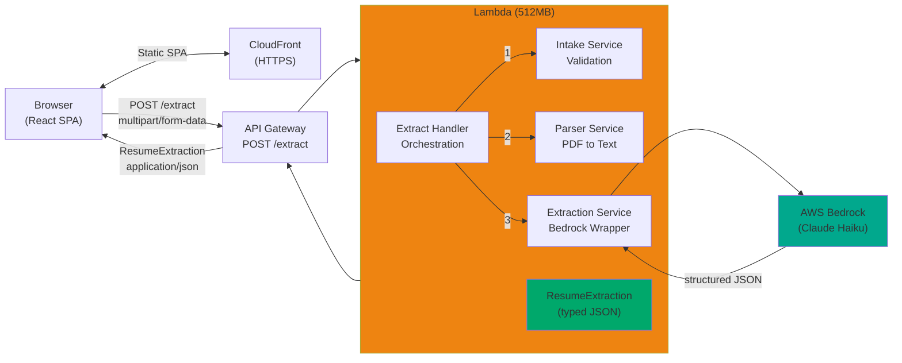

# resume-lens

**AI integration portfolio project** — Synchronous résumé extraction using AWS Lambda, Bedrock, and TypeScript.

Upload a PDF résumé → receive structured, typed JSON extraction of the candidate's profile, including an **AI-inferred seniority level** computed by Claude on AWS Bedrock.

---

## 🎯 Purpose

`resume-lens` demonstrates production-quality AI integration skills. It showcases:

- **Architectural judgment**: AWS-native stack (Bedrock over direct API, Lambda, CDK) with clean separation of concerns
- **AI integration patterns**: Structured extraction with confidence signals, distinguishing parsing from inference
- **TypeScript discipline**: Shared types across frontend/backend enforcing contracts at compile time
- **End-to-end ownership**: Frontend, backend, infrastructure-as-code, and comprehensive documentation

**Intended audience:** Technical reviewers, hiring managers, and architects evaluating AI integration capability at scale.

**Note:** The intent of the project is to specifically highlight the AI integration with AWS Bedrock located in the Lambda function. The other components, e.g. the web frontend, serve to facilitate the interaction with the AI and are not necessarily designed with the same robustness as a production-ready React app would be.

---

## 🏗️ Architecture Overview

### Data Flow



**Key characteristics:**

- **Synchronous**: Request → extract → respond. No queues, no async processing.
- **Memory-only**: Documents held in Lambda memory for single invocation only. No S3, no persistence.
- **Typed end-to-end**: `ResumeExtraction` interface enforced across frontend and backend at compile time.
- **Confidence transparency**: Per-section extraction confidence (`experience`, `education`, `skills`) rated `high | medium | low`.

---

## 🤖 AI Integration Design

### Why AWS Bedrock Over Direct Anthropic API? (AD-002)

The stack uses **AWS Bedrock with Claude Haiku**, not a direct Anthropic API connection, for three reasons:

1. **AWS-native**: Entire solution stays within AWS ecosystem, signaling architectural consistency.
2. **IAM-based auth**: Lambda execution role grants Bedrock access — no API keys in code or `.env`. This is a meaningful security signal for enterprise teams.
3. **Cost**: Haiku is the lowest-cost model on Bedrock with sufficient capability for structured extraction from clean text (résumé content).

**Trade-off acknowledged**: Bedrock requires more AWS account setup than a direct API key. That configuration complexity is itself a portfolio signal — it demonstrates ownership across the full stack, not just application code.

### Inference vs. Parsing: `inferredSeniorityLevel` (AD-009)

The extraction schema includes one **AI-inferred field** that demonstrates the distinction between parsing and intelligence:

```typescript
inferredSeniorityLevel: 'junior' | 'mid' | 'senior' | 'principal' | 'unknown';
```

This field is **not extracted literally** from résumé text. Instead, the model reads the candidate's full experience, titles, skills, and education holistically and infers their likely seniority level. It is the natural conversation anchor in a portfolio review — it shows that the system reasons about résumé content rather than just parsing it.

**Confidence signals** per section allow the frontend to surface extraction uncertainty without exposing model internals — a sign of extraction maturity.

### Prompt Construction

The extraction service constructs a detailed prompt that:

- Structures the output to match the JSON schema (`Resume` interface)
- Instructs the model on confidence assessment per section
- Provides examples of seniority inference from experience/title/education patterns
- Specifies null handling for missing/ambiguous fields

This structured approach ensures consistent, predictable extraction and signals careful prompt engineering rather than ad-hoc prompting.

---

## 📦 Tech Stack

| Layer            | Technology            | Notes                                  |
| :--------------- | :-------------------- | :------------------------------------- |
| Frontend         | React + Vite          | Vanilla SPA, no routing library        |
| Frontend hosting | S3 + CloudFront       | AWS-native static hosting              |
| API              | Lambda (TypeScript)   | Plain handlers, 512MB memory           |
| PDF parsing      | `unpdf` (npm)         | In-process, no external service        |
| AI provider      | AWS Bedrock (Haiku)   | On-demand, IAM-authenticated           |
| Infrastructure   | AWS CDK (TypeScript)  | Single stack, all resources co-located |
| Automation       | GitHub Actions        | CI, deploy, and teardown workflows     |
| Language         | TypeScript throughout | Shared types across all packages       |

---

## 📂 Monorepo Structure

```
resume-lens/
├── packages/
│   ├── shared/              # Shared types, error codes — zero runtime dependencies
│   ├── api/                 # Lambda handler + three-stage extraction pipeline
│   └── web/                 # React SPA frontend
├── infra/                   # AWS CDK stack (TypeScript)
├── docs/
│   ├── project-overview.md  # Detailed tech stack, architecture, data flow
│   └── architectural-decisions.md  # Design rationale (AD-001 through AD-012)
├── .github/
│   └── copilot-instructions.md  # Development guidance, coding standards
└── package.json             # npm workspaces root
```

**Key insight**: TypeScript is used everywhere — frontend, backend, infrastructure. This consistency is intentional and signals architectural discipline.

See [Project Overview](./docs/project-overview.md) for detailed structure and responsibilities of each package.

---

## 🚀 Local Development

### Prerequisites

- **Node.js**: 24.15.0 (use `nvm install && nvm use`)
- **npm**: 10+
- **AWS CLI**: Configured with credentials for Bedrock access
- **AWS region**: Set to a region with Bedrock model availability (e.g., `us-west-2`, `us-east-1`)

### Setup

1. **Clone and install dependencies**

   ```bash
   git clone https://github.com/mwarman/resume-lens.git
   cd resume-lens
   npm install
   ```

2. **Configure environment**

   Create a `.env` file in the `packages/web` by copying `.env.example`:

   ```env
   VITE_API_BASE_URL=https://your.api.gateway.url
   ```

### Notes

- The Lambda handler is a plain TypeScript function — no framework overhead.
- API responses are typed against `@resume-lens/shared` in the frontend, catching contract violations at compile time.
- Local invocation uses your AWS credentials directly; Bedrock calls are authenticated via IAM.

---

## 🛠️ Deployment

### Prerequisites

- **AWS Account**: With permissions to create Lambda, API Gateway, S3, CloudFront, IAM roles
- **AWS CLI**: Installed and configured (`aws configure`)
- **AWS CDK CLI**: Install globally with `npm install -g aws-cdk`
- **CDK Bootstrap**: Run `cdk bootstrap aws://<ACCOUNT_ID>/<REGION>` once per AWS account/region

### Deploy

1. **Build all packages**

   ```bash
   npm run build
   ```

2. **Deploy the stack**

   ```bash
   cd infra
   npm run cdk:deploy
   ```

   The CDK stack provisions:
   - Lambda function with Bedrock IAM permissions
   - API Gateway with POST /extract route
   - S3 bucket and CloudFront distribution for the React frontend
   - All necessary IAM roles and policies

3. **Deploy the frontend**

   After the stack deploys, it outputs the S3 bucket name and CloudFront URL. Build and upload the React app:

   ```bash
   npm run --workspace=packages/web build
   aws s3 sync packages/web/dist/ s3://<BUCKET_NAME>/ --delete
   ```

4. **Access the app**

   Open the CloudFront URL output by CDK in your browser.

### Monitoring

- **Lambda logs**: `aws logs tail /aws/lambda/resume-lens-extract --follow`
- **API requests**: CloudWatch Logs via AWS Console
- **Bedrock usage**: Bedrock console shows model invocation metrics

---

## 💰 Cost Profile

Estimated monthly cost at demo scale (~100 invocations):

| Resource                              | Monthly Cost |
| :------------------------------------ | :----------- |
| Lambda (100 invocations, 512MB, ~5s)  | ~$0.01       |
| API Gateway (100 requests)            | ~$0.00       |
| Bedrock (Claude Haiku, ~2K tokens)    | ~$0.05       |
| S3 + CloudFront (static, low traffic) | ~$0.02       |
| **Total**                             | **< $0.10**  |

At production scale (10K invocations/month), costs remain sub-$10.

---

## 📚 Documentation

- **[Project Overview](./docs/project-overview.md)** — Detailed tech stack, monorepo structure, data flow, output schema, error handling, cost profile
- **[Architecture Decisions](./docs/architecural-decisions.md)** — Authoritative log of all design decisions (AD-001 through AD-012) with rationale and trade-offs
- **[Copilot Instructions](./github/copilot-instructions.md)** — Development guidance, coding standards, build order, and when to escalate

---

## 📖 Build Order (Recommended)

Follow this sequence to build and test end-to-end:

1. **`packages/shared`** — Types and error codes first; all other packages depend on this
2. **`packages/api`** — Lambda handler and extraction services; test locally before deploying
3. **`infra/`** — AWS CDK stack; deploy Lambda + API Gateway and validate end-to-end
4. **`packages/web`** — React SPA frontend; build against deployed API and deploy to S3/CloudFront last

---

## 📝 License

MIT
